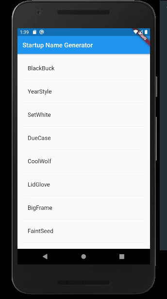

## Flutter Codelabs Series

-[x]  [Write your first Flutter app, part 1](http:/https://codelabs.developers.google.com/codelabs/first-flutter-app-pt1/index.html?index=..%2F..index#0/ "Write your first Flutter app, part 1")

-[]   [Write your first Flutter app, part 2](http://codelabs.developers.google.com/codelabs/first-flutter-app-pt2/index.html?index=..%2F..index#0 "Write your first Flutter app, part 2")
-[]     [MDC-101 Flutter: Material Components (MDC) Basics (Flutter)](http://https://codelabs.developers.google.com/codelabs/mdc-101-flutter/index.html?index=..%2F..index#0 "MDC-101 Flutter: Material Components (MDC) Basics (Flutter)")
-[]     [MDC-102 Flutter: Material Structure and Layout (Flutter)](http://https://codelabs.developers.google.com/codelabs/mdc-102-flutter/index.html?index=..%2F..index#0 "MDC-102 Flutter: Material Structure and Layout (Flutter)")
-[]     [MDC-103 Flutter: Material Theming with Color, Shape, Elevation, and Type (Flutter)](http://codelabs.developers.google.com/codelabs/mdc-103-flutter/index.html?index=..%2F..index#0 "MDC-103 Flutter: Material Theming with Color, Shape, Elevation, and Type (Flutter)")
-[]     [MDC-104 Flutter: Material Advanced Components (Flutter)](http://https://codelabs.developers.google.com/codelabs/mdc-104-flutter/index.html?index=..%2F..index#0 "MDC-104 Flutter: Material Advanced Components (Flutter)")
